## Contents

* [Activity](#activity)
* [Build Definitions](#build-definitions)
* [Build Process Templates](#build-process-templates)
* [Security](#security)
* [Source Control](#source-control)
* [Work Item Configuration - Compare](#work-item-configuration---compare)
* [Work Item Configuration - Work Item Types](#work-item-configuration---work-item-types)
* [Work Item Configuration - Categories](#work-item-configuration---categories)
* [Work Item Configuration - Process Configuration](#work-item-configuration---process-configuration)
* [Work Item Configuration - Transform](#work-item-configuration---transform)

## Activity

Allows you to see the most recent activity in each Team Project.
This can be useful if you want to see which projects are still actively being worked on, for example.

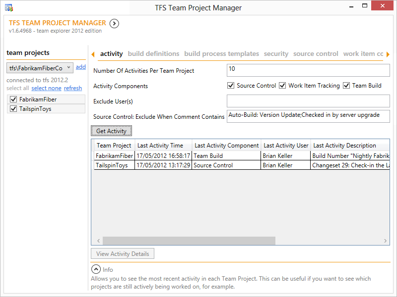

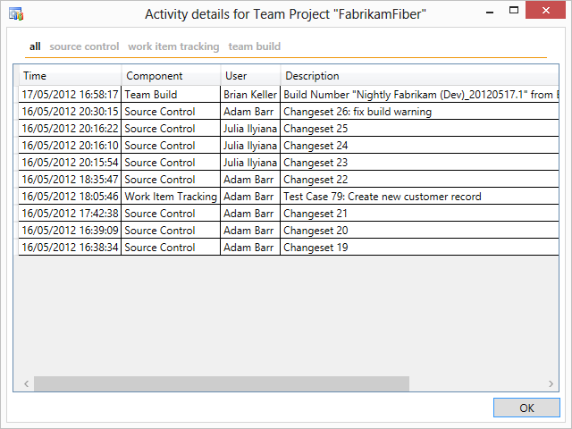

## Build Definitions

Allows you to track the build definitions in each Team Project, and some of their common properties. You can also bulk update or delete build definitions.
This can be useful when you want to get an overview of all the builds or want to standardize certain build properties across Team Projects.

## Build Process Templates

### View / Unregister

Allows you to track the build process templates that are registered for each Team Project, and which build definitions actually use them.
This can be useful when you want to get an overview of all the builds and their build process templates.

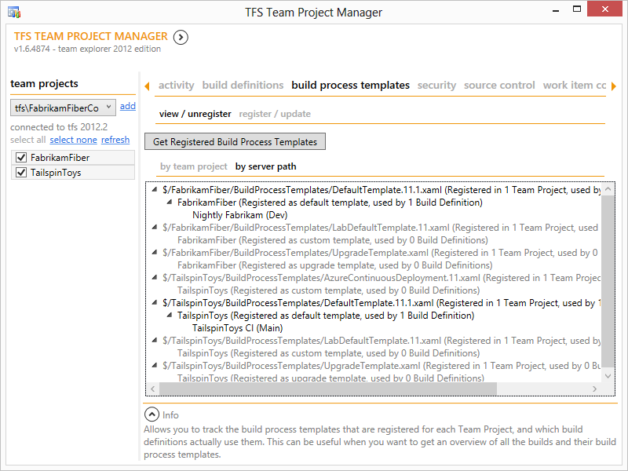

### Register / Update

Allows you to register new build process templates across multiple Team Projects, optionally unregistering any other template.
This can be useful when you want to standardize on a single build process template for a selection of Team Projects in your organization.

## Security

### View / Export / Delete Groups

Allows you to view and delete the security groups that are defined for each Team Project.
This can be useful when you want to get an overview of all the security groups being used.
You can also export the permissions to a file which can be used when adding or updating groups.

### Add / Update Group

Allows you to add or update security groups across multiple Team Projects.
This can be useful when you want to have consistent security groups or when you want to import new work item types that require certain security groups to be present.

## Source Control

### View Settings

Allows you to get an overview of the source control settings for each Team Project: whether or not "multiple check-out" and "get latest on check-out" are enabled, and which check-in notes are configured. Note that viewing the configured check-in policies is not supported at this time.

### Update Settings

Allows you to change the source control settings across multiple Team Projects.
Note that configuring check-in policies is not supported at this time.

### View Branch Hierarchies

Allows you to get an overview of the branches across multiple Team Projects.

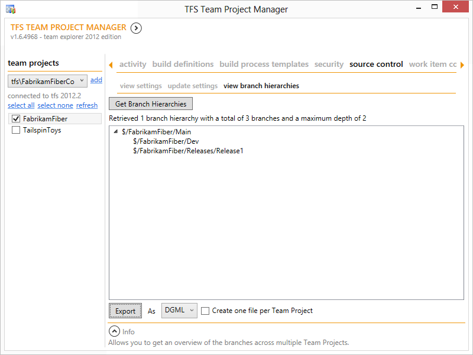

You can also export the hierarchy to XML or DGML so it can be visualized and interacted with in Visual Studio.

## Work Item Configuration - Compare

Allows you to compare the work item configuration (i.e. work item type definitions, work item categories and common and agile process configuration) used by Team Projects with work item configuration definition files on disk (e.g. from a Process Template) or from other Team Projects.
This can be useful to determine which Team Projects have been created with which Process Template, or which Team Projects have changed their work item configuration from a standard configuration.

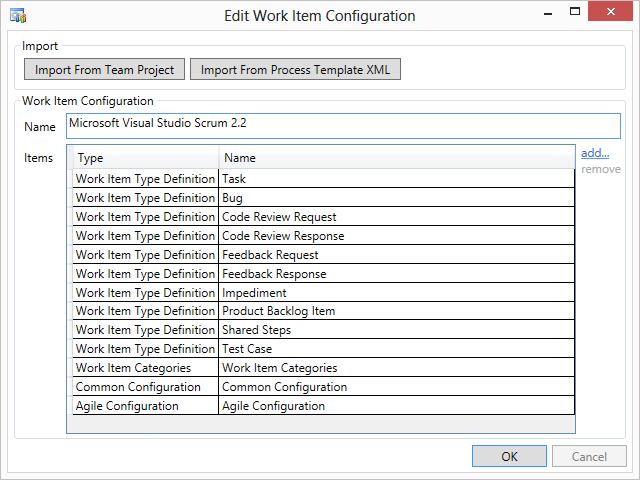

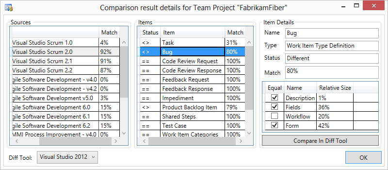

## Work Item Configuration - Work Item Types

### View / Export / Delete / Edit

Allows you to get an overview of the work item type definitions across multiple Team Projects, how many work items have been created from them, and in which work item categories they are used.
You can also export their definitions to XML files, edit them in-place, and delete the work item types from the Team Projects.

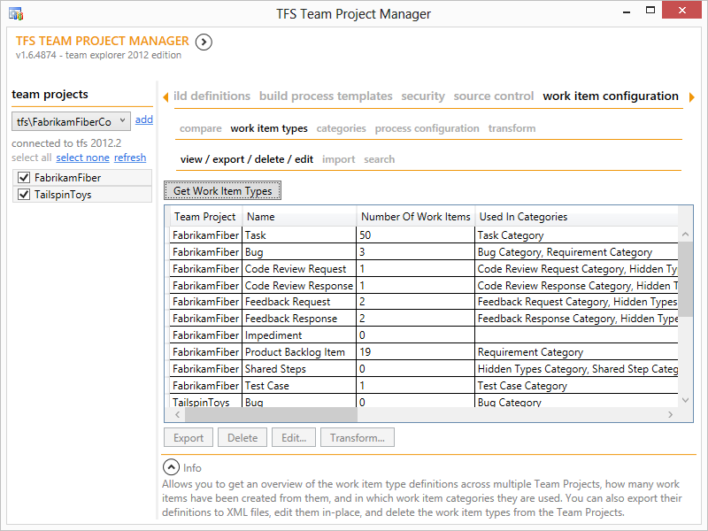

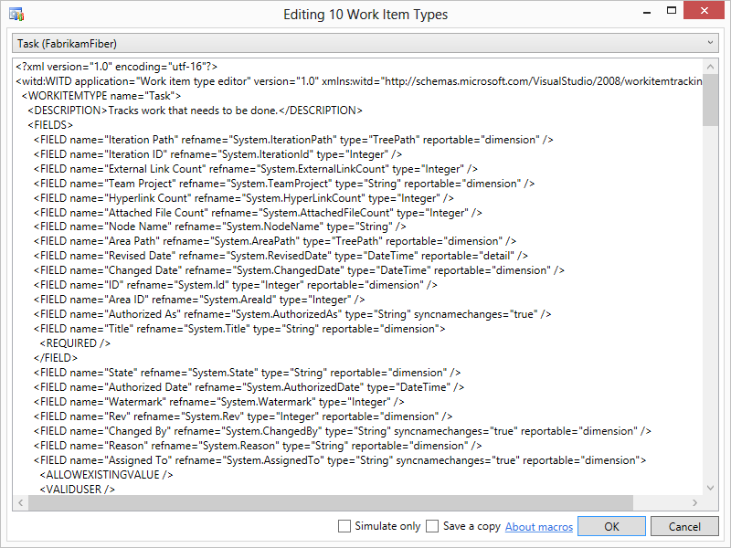

### Import

Allows you to validate and import new work item type definitions in existing Team Projects.
This can be useful if you want to change the work item types being used, e.g. to upgrade them from a previous version.

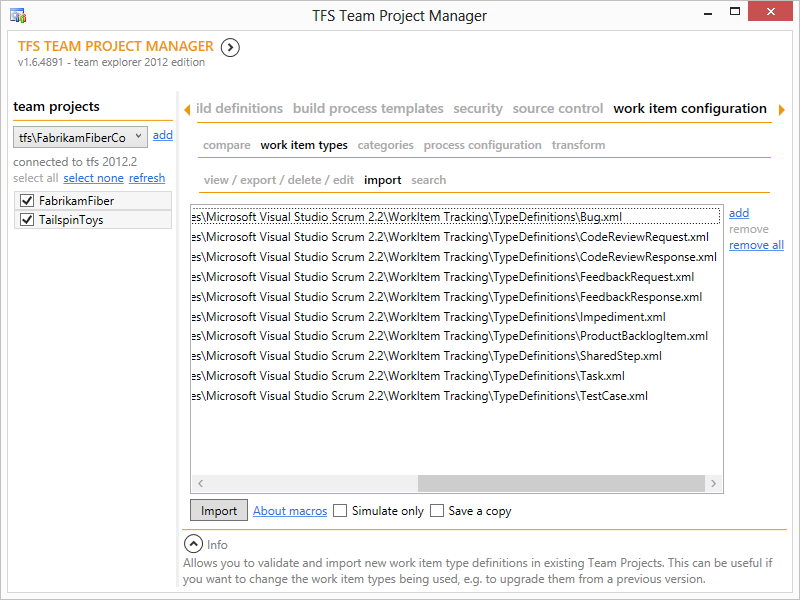

### Search

Allows you to search for work item types and/or fields within them.
This can be useful if you want to know if certain work items or fields are present in selected Team Projects.

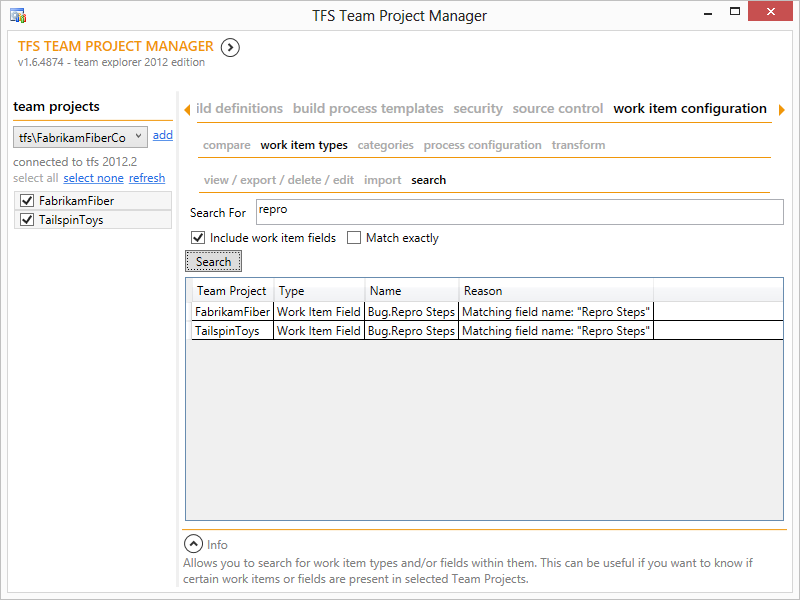

## Work Item Configuration - Categories

### Export / Edit

Allows you to export the work item categories to XML files and edit them in-place.

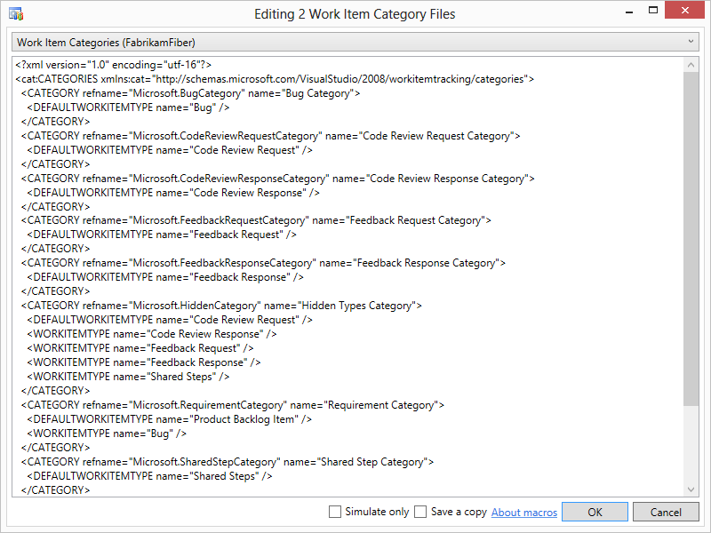

### View / Delete

Allows you to get an overview of all work item categories across Team Projects, and the work items that belong to them.
You can even delete work item categories from Team Projects.

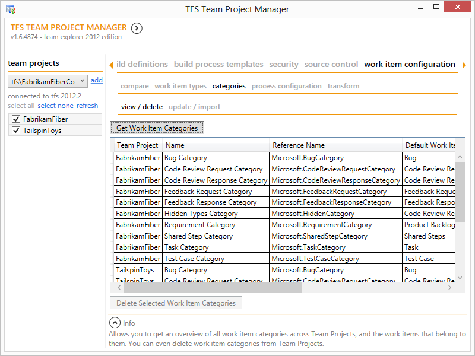

### Update / Import

Allows you to define work item categories across Team Projects, by creating them from scratch or by importing them from an existing Team Project.
This can be useful if you want to change work item categories or if you want to delete work item types that are part of categories (in which case you have to remove them from any categories first).

## Work Item Configuration - Process Configuration

### View / Export / Edit

Allows you to get an overview of the work item process configurations (i.e. common and agile configurations) across multiple Team Projects. You can also export their definitions to XML files and edit them in-place.

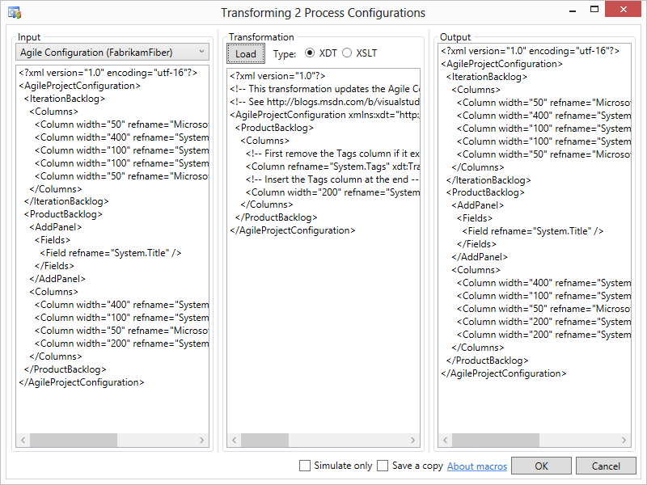

### Import

Allows you to import work item process configurations (i.e. common and agile configurations) in existing Team Projects.
This can be useful if you want to change the process configurations being used, e.g. to upgrade them from a previous version.

## Work Item Configuration - Transform

Allows you to transform the XML files that define the work item configuration (i.e. work item type definitions, work item categories and common and agile process configuration).
This can be useful if you want have upgraded Team Foundation Server and want to take advantage of new features.

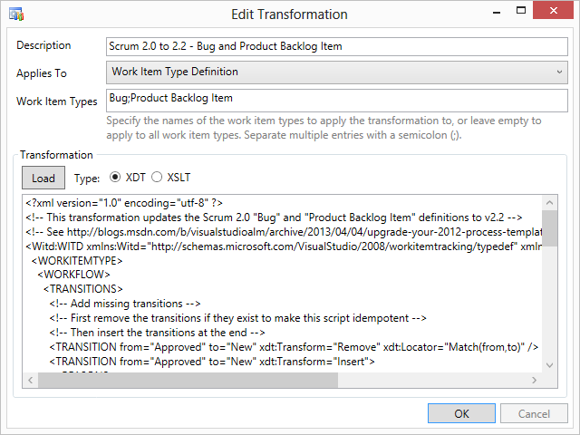
