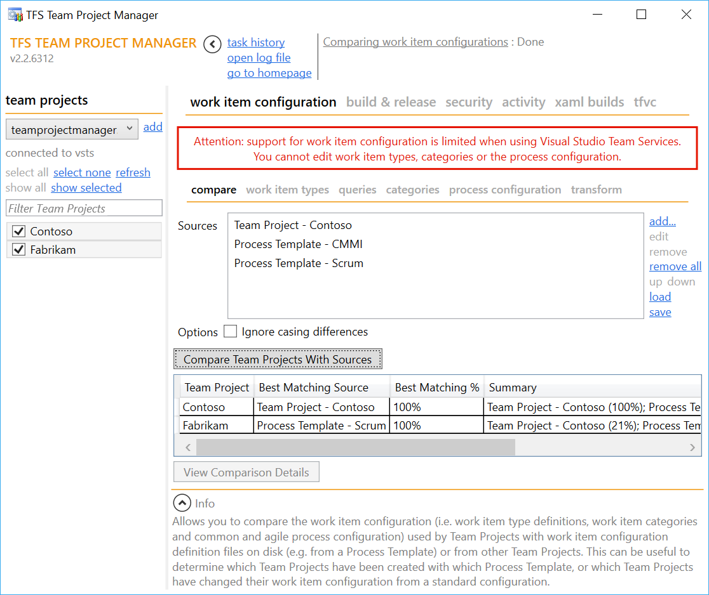

TFS Team Project Manager automates various tasks across Team Projects in Team Foundation Server. If you find yourself managing multiple Team Projects for an organization and have recurring tasks and questions that repeat themselves over and over again, Team Project Manager probably has some answers for you.

## Features

Team Project Manager has the following modules:

* **Work Item Configuration**
  * Compare work item configurations (i.e. work item type definitions, categories, process configuration) with various sources, e.g. to determine which Process Template was likely used to create which project
  * Understand which projects use which work item types and how many work items there are of each
  * Import new or update existing work item types
  * Manage work item queries
  * Manage work item categories
  * Manage process configuration
  * Transform work item tracking configuration (i.e. apply XML transformations on work item type definitions, categories, process configuration)
* **Build & Release**
  * View and delete build definitions
  * Update common properties within build definitions
  * View and delete build templates
  * Import build templates
* **Security**
  * Understand which security groups have which members
  * Delete security groups
  * Export permissions from existing security groups
  * Add or update security groups
  * Manage members and permissions for security groups
* **Activity**
  * View recent activity (from TFVC, Git, Work Item Tracking and builds)
* **Manage XAML Builds**
  * View and delete build definitions
  * Update common properties within build definitions
  * Understand which build templates are used by which build definitions
  * Unregister existing build process templates
  * Register new or update existing build process templates
* **Manage Team Foundation Version Control**
  * Understand which projects have which source control settings (multiple check-out, get latest on check-out, check-in notes)
  * Update source control settings
  * Visualize branch hierarchies

If you can think of other great features, please let us know through the discussion forums or the issue tracker! Or (even better) because it's built with a very modular framework ([Microsoft Prism](http://compositewpf.codeplex.com/)) you can also contribute by building your own modules!

## Compatibility

TFS Team Project Manager works against any version of Team Foundation Server, including Visual Studio Team Services (even though not all features are always supported there).

## Free Software

This application is completely free to use. If you feel it saves you a lot of time and you like it so much that you want to support the countless hours that have gone in developing this - please do feel free to [donate](https://www.paypal.com/cgi-bin/webscr?cmd=_donations&business=GJDYX8VK62BBG&lc=US&item_name=TFS%20Team%20Project%20Manager&currency_code=EUR&bn=PP%2dDonationsBF%3abtn_donate_LG%2egif%3aNonHosted)!

## How To Contribute

If you want to contribute any code (features or bug fixes) to this project, then you're awesome. Follow the standard procedure to [create a pull request](https://help.github.com/articles/creating-a-pull-request/).

Although not strictly required, we would appreciate that you associate an issue with your changes so it's very obvious what your PR is supposed to do. If an issue doesn't exist yet, please don't hesitate to create one. This helps us understand the scope and impact of your changes and allow us to more easily integrate them into the main code base.

Here are some base rules for contributors:
* Follow the philosophy of the tool.
  * The tool aims to automate various tasks across Team Projects in Team Foundation Server.
  * It's mostly the "across Team Projects" part that's important here: there are many tools (command-line or other) that you can use to automate certain tasks, but the big benefit here is that you can do them in bulk for a lot of projects at once.
  * If your feature doesn't fit in with the mindset that it's an operation to be performed on many Team Projects, or on the Team Project Collection above it, it's probably not a good candidate.
* Create an issue for every feature or bug so that it’s clear what you’re working on and what is in each release.
* Have fun and create cool stuff.
  * Spread the word about the tool and your contribution to it!
  * Did I mention you're awesome?